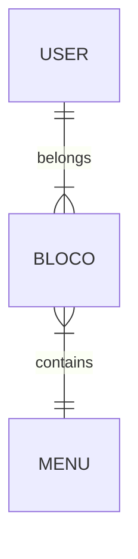

<h1 align="center">ReactMobile</h1>

> Quer melhorar este projeto? Sinta-se livre para [contribuir](https://github.com/MQ-J/ReactMobile/pulls)

> Tem idéia de um nome melhor pra ele? Mande sua sujestão [aqui!](https://github.com/MQ-J/ReactMobile/issues)

# Banco de dados
O banco utilizado foi o [ElephantSQL](https://customer.elephantsql.com), que funciona com PostgreSQL.

Estas são as classes deste projeto, onde o USER é você😊, BLOCO é um bloco de anotação e MENU são os seus tópicos.



# Alterar rotas com base no ambiente

Quando o modo do webpack for diferente de 'development', a rota é alterada para se encaixar no caminho dos arquivos no Github Pages.

Trecho simplificado do arquivo **[App.jsx](https://github.com/MQ-J/ReactMobile/blob/main/src/App.jsx)** a seguir:

```javascript
let basename = process.env.NODE_ENV == "development" ? "" : "/ReactMobile/dist"
<Router basename={basename}>
  //rotas das views aqui
</Router>
```

# Comunicação com Backend Laravel usando API

O processamento dos dados dos formulários é feito em um projeto Laravel no Heroku, com banco de dados Elephantsql.

Usando Fetch, determinada função (Web Service) é chamada, e a resposta é tratada, como vemos no exemplo simplificado a seguir:

```javascript
const url = process.env.NODE_ENV == "development" ? "http://127.0.0.1:8000" : "https://realSiteOnline"

      fetch(`${url}/apiRouteHere`,
        {
          // body, headers and method
        }
      ).then((res) => res.json()).then((res) => {

          if (res['status'] == 'ok') {
            // quando der certo
          } else {
            // quando der errado
          }
        }
      );
```

# Login com LocalStorage e Logout

Este projeto usa LocalStorage para pular o formário de login quando já houver um usuário logado no navegador:

```javascript
  localStorage.getItem("user") ? 
    useEffect(() => {
      navigate(localStorage.getItem("user"))
    },[])
  : console.log("faça o login")
```

No logout, também remove o localStorage e muda a rota com base no ambiente:

```javascript
const url = process.env.NODE_ENV == "development" ? "/" : "/ReactMobile/dist"
    const removeLogin = () => {
        localStorage.removeItem("user")
        location = url
    }
```

# Como Usar este projeto


- *npm install*
  - Para baixar as dependências
- *npm run start*
  - Rodar o projeto em modo desenvolvedor, no localhost

- *npm run build-prod*
  - Gera o bundle.js, arquivo necessário para o projeto rodar em produção (no Github Pages, por exemplo).