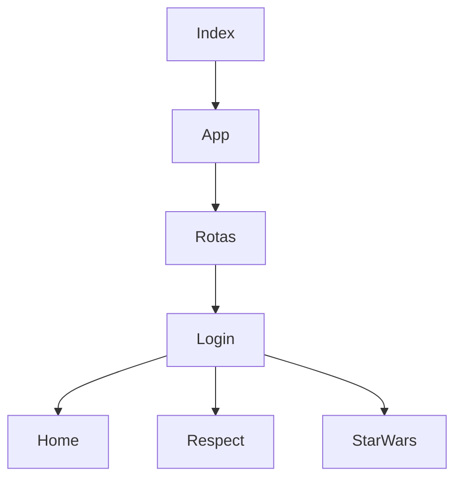

## Alterar rotas com base no ambiente

Quando o modo do webpack for diferente de 'development', a rota é alterada para se encaixar no caminho dos arquivos no Github Pages. Trecho simplificado do arquivo Rotas.jsx a seguir:

```javascript
let basename = process.env.NODE_ENV == "development" ? "" : "/ReactMobile/dist"
<Router basename={basename}>
```

- Desenvovimento
  - npm run start
- Produção
  - npm run build-prod

## Controle de Login

FETCH tem costume de usar cache, mas como este projeto usa fetch para pesquisar os usuários válidos, foi preciso desativar o uso do cache. Visão simplificada deste trecho do arquivo Login.jsx:

```javascript
fetch("url",
      {
        headers: {
          Accept: "application/json"
        },
        cache: "no-store"
      })
```

As rotas secundárias não funcionam diretamente. É preciso passar pela rota principal (consequentemente, fazer o login) para chegar nas demais rotas.
Acredito que isso se deve ao fato das rotas não serem em volta de todo o site, mas dentro de um componente:



## Limitations in Android

Due to security restrictions in Android, execute permissions on write-allowed storage is likely forbidden on most stock devices. This prevents some npm scripts from working properly as `npm run` rely on the use of `sh` which requires exec permissions.

The `node` program is also built as a shared library for compatibility with future versions of Android and can only be accessed from the terminal and not `sh`.

For these reasons, using `npm run ...` will not work from the terminal, but entering the command (`webpack`) directly in the terminal will work.
